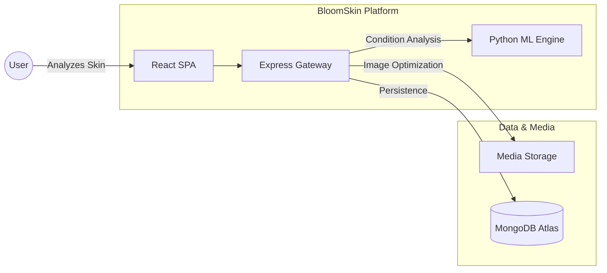

# BloomSkin 🌸 — Your AI-Powered Dermatologist


**BloomSkin** is a state-of-the-art dermatological analysis platform that transforms your smartphone into a professional skin diagnostic tool. By merging deep learning (CNNs) with a medical-grade knowledge base, BloomSkin provides users with instant, accurate, and personalized skin health journeys.

---

## 🏗️ Product Architecture

BloomSkin is built on a high-performance distributed architecture designed for scalability and sub-second analysis.

### System Context


---

## 🌟 Advanced Product Features

- **🔬 Precision AI Scan**: Uses a custom-trained Convolutional Neural Network (CNN) to detect 5+ skin conditions (Acne, Cyst, Papules, Pustules, etc.) with high confidence.
* **📈 Skin Health Dashboard**: A centralized hub that tracks your "Bloom Score," severity trends, and scan frequency using interactive charts.
* **🧬 Dynamic Recommendation Engine**: A weighted logic system that analyzes your scan history to recommend specific ingredients and products tailored to your skin's current state.
* **🗓️ Smart Routine Planner**: Automatically generates a 7-day personalized skincare routine (Morning & Evening) based on your latest AI diagnostics.
* **📸 Face-Aware Analysis**: Integrated MTCNN face detection to ensure scans are taken correctly, reducing false positives.
* **🔐 Enterprise-Grade Auth**: Secure Google OAuth 2.0 and JWT-based session management.
* **📱 Premium UI/UX**: A sleek, dark-mode-ready interface built with Tailwind CSS, Lucide icons, and fluid Framer Motion animations.

---

## 🛠️ Technical Tech Stack

### Frontend
- **React 19 (Vite)**: Ultra-fast SPA framework.
- **Tailwind CSS v4**: Modern utility-first styling.
- **Framer Motion**: Premium micro-animations.
- **Lucide React**: Vector-perfect product iconography.

### Backend & ML
- **Node.js & Express**: High-concurrency API gateway.
- **MongoDB Atlas**: Scalable NoSQL document storage.
- **Flask (Python)**: High-performance ML serving layer.
- **TensorFlow/Keras**: Core deep learning analysis models.

---

## ⚡ Quick Start

### 1. Repository Setup
```bash
git clone https://github.com/rasikarakhewar3010/Bloom-Skin.git
cd Bloom-Skin
```

### 2. Environment Configuration
For both the `backend/` and `frontend/` directories, copy the provided `.env.example` file to create your own `.env` file and fill in your credentials:

```bash
# In backend/
cp .env.example .env

# In frontend/
cp .env.example .env

# In bloom-skin-ml/
cp .env.example .env
```

### 3. Local Installation
```bash
# Start Backend
cd backend && npm install && npm start

# Start ML Engine (Python venv required)
cd bloom-skin-ml && pip install -r requirements.txt && python app.py

# Start Frontend
cd frontend && npm install && npm run dev
```

---

## 📂 Architecture Overview

```text
BloomSkin/
├── backend/
│   ├── config/              # Passport, Cloudinary configs
│   ├── controllers/         # Business logic (auth, predict, dashboard, etc.)
│   ├── data/                # Recommendation knowledge base
│   ├── middleware/           # Auth guard, rate limiters
│   ├── models/              # Mongoose schemas (User, History)
│   ├── routes/              # Express route definitions
│   └── app.js               # Entry point with security middleware
├── frontend/
│   ├── src/
│   │   ├── components/      # Shared UI (ProtectedRoute, NotFound, etc.)
│   │   ├── context/         # Auth state management
│   │   ├── HomePage/        # Landing page sections
│   │   └── [Feature]Page/   # Dashboard, History, Routine, etc.
│   └── index.html           # SEO-optimized entry point
└── bloom-skin-ml/
    ├── model/               # TensorFlow .h5 model
    └── app.py               # Flask ML inference service
```

---

## 🔐 Security Architecture

BloomSkin implements **defense-in-depth** security across all layers:

| Layer | Implementation |
|---|---|
| **HTTP Headers** | `helmet` — XSS protection, HSTS, CSP, MIME sniffing prevention |
| **Rate Limiting** | `express-rate-limit` — Per-route limits (auth: 15/15min, uploads: 5/min, exports: 3/hr) |
| **Authentication** | Passport.js with Google OAuth 2.0 + Local strategy, session-based with MongoStore |
| **Route Protection** | Frontend `<ProtectedRoute>` component guards all authenticated pages |
| **Input Validation** | Server-side email/password validation, file type/size filtering (5MB max) |
| **Session Security** | HttpOnly cookies, SameSite policy, secure flag in production |
| **File Upload Security** | Multer MIME type filter + size limit + Cloudinary virus scanning |
| **Error Handling** | Global error handler prevents stack trace leaks in production |
| **SSL/TLS** | Full certificate verification on all outbound HTTPS requests |

---

*© 2026 BloomSkin Inc. Developed for precision skin health.*


