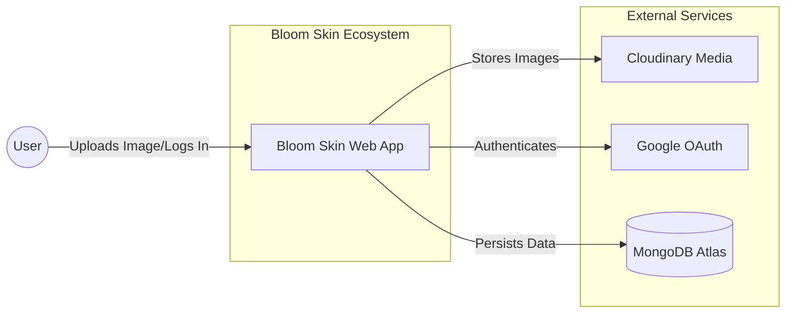
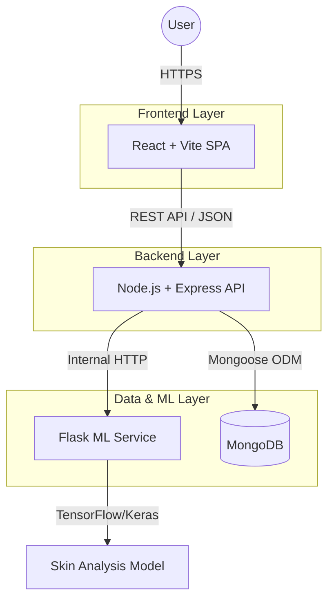

# Bloom Skin 🌸


**Bloom Skin** is an advanced AI-powered dermatological analysis platform designed to democratize access to personalized skin health insights. By leveraging deep learning models and a modern distributed architecture, Bloom Skin offers users instant analysis of skin conditions (such as Acne, Cyst, Papules) and provides tailored recommendations.

---

## 🚀 Live Demo

- **Frontend Application**: [https://bloom-skin-frontend.onrender.com/](https://bloom-skin-frontend.onrender.com/) 
- **Backend API**: [https://bloom-skin-backend.onrender.com](https://bloom-skin-backend.onrender.com)

---

## 🏗️ System Architecture

Bloom Skin utilizes a microservices-inspired architecture to separate concerns between the user interface, business logic, and computationally intensive machine learning tasks.

### System Context
High-level view of how users interact with the system.



### Container Architecture
Detailed view of the application containers and their communication protocols.



---

## ✨ Key Features

- **🤖 AI-Powered Skin Analysis**: Utilizes a custom-trained Convolutional Neural Network (CNN) to detect skin conditions like Blackheads, Cysts, Papules, Pustules, and Whiteheads.
- **🔒 Secure Authentication**: Robust user management with JWT-based authentication and Google OAuth integration.
- **📸 Smart Image Processing**: Automatic face detection and cropping using MTCNN to ensure high-accuracy analysis.
- **☁️ Cloud Storage**: Seamless integration with Cloudinary for secure and scalable image storage.
- **📊 History & Tracking**: Users can track their skin health journey over time with a persistent history of past analyses.
- **📱 Responsive Design**: A mobile-first UI built with Tailwind CSS and Framer Motion for smooth animations.

---

## 🛠️ Tech Stack

### Frontend
- **Framework**: React 19 (Vite)
- **Styling**: Tailwind CSS v4, Framer Motion
- **State Management**: React Context API
- **HTTP Client**: Axios

### Backend
- **Runtime**: Node.js
- **Framework**: Express.js
- **Database**: MongoDB (Mongoose ODM)
- **Authentication**: Passport.js (Local & Google Strategy)
- **File Handling**: Multer + Cloudinary

### Machine Learning Service
- **Framework**: Flask
- **Core Libraries**: TensorFlow, Keras, OpenCV, NumPy, Pillow
- **Face Detection**: MTCNN

---

## ⚡ Getting Started

Follow these instructions to set up the project locally.

### Prerequisites
- **Node.js** (v16+)
- **Python** (v3.8+)
- **MongoDB** (Local or Atlas URI)
- **Cloudinary Account**

### 1. Clone the Repository
```bash
git clone https://github.com/yourusername/bloom-skin.git
cd bloom-skin
```

### 2. Backend Setup
Navigate to the backend directory and install dependencies.
```bash
cd backend
npm install
```

Create a `.env` file in the `backend` directory:
```env
PORT=3000
MONGO_URI=your_mongodb_connection_string
SESSION_SECRET=your_session_secret
CLOUDINARY_CLOUD_NAME=your_cloud_name
CLOUDINARY_API_KEY=your_api_key
CLOUDINARY_API_SECRET=your_api_secret
GOOGLE_CLIENT_ID=your_google_client_id
GOOGLE_CLIENT_SECRET=your_google_client_secret
CLIENT_URL=http://localhost:5173
ML_API_URL=http://localhost:5000
```

Start the backend server:
```bash
npm start
```

### 3. ML Service Setup
Navigate to the ML directory.
```bash
cd ../bloom-skin-ml
```

Create a virtual environment and install dependencies:
```bash
python -m venv venv
# Windows
venv\Scripts\activate
# Mac/Linux
source venv/bin/activate

pip install -r requirements.txt
```

Ensure your trained model (`skin_problem_classifier_v1.h5`) is placed in `bloom-skin-ml/model/`.

Start the Flask service:
```bash
python app.py
```

### 4. Frontend Setup
Navigate to the frontend directory.
```bash
cd ../frontend
npm install
```

Start the development server:
```bash
npm run dev
```

Visit `http://localhost:5173` to view the application.

---

## 📂 Project Structure

```
Bloom Skin/
├── backend/                 # Node.js Express API
│   ├── config/             # DB & Passport config
│   ├── controllers/        # Request handlers
│   ├── models/             # Mongoose schemas
│   ├── routes/             # API endpoints
│   └── app.js              # Entry point
│
├── frontend/                # React Vite Application
│   ├── src/
│   │   ├── components/     # Reusable UI components
│   │   ├── context/        # Global state (Auth, UI)
│   │   ├── pages/          # Full page views
│   │   └── assets/         # Static assets
│
└── bloom-skin-ml/          # Python Flask ML Service
    ├── model/              # .h5 Model files
    └── app.py              # Flask application
```

---


